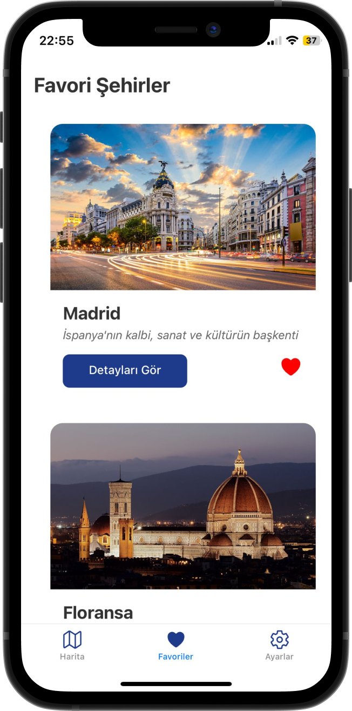
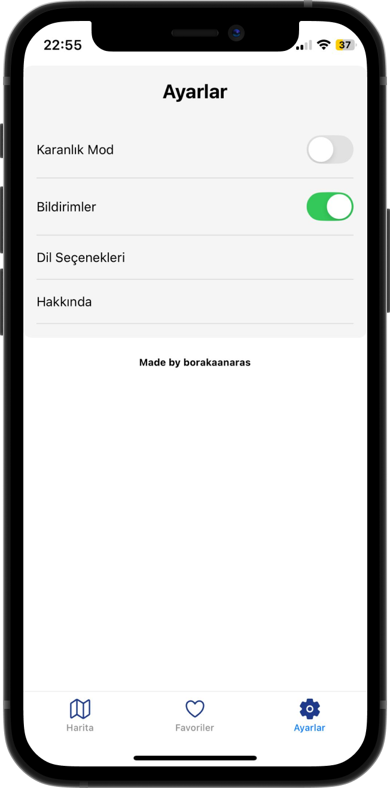

# 🌍 On Earth - Şehir Rehberi

  

## 📱 Uygulama Hakkında

On Earth, Türkiye ve dünyadan şehirleri keşfetmenizi sağlayan kapsamlı bir şehir rehberi uygulamasıdır. Şehirlerin tarihi, kültürü, yemekleri ve gezilecek yerleri hakkında detaylı bilgiler sunar.

## 🖼️ Ekran Görüntüleri

  
  
  
  
  
  
  
  
  

## 📱 Uygulama Özellikleri

- 🔍 Gelişmiş şehir arama
- 🚗 Ulaşım bilgileri
- ❤️ Favori şehirler listesi
- 🏛️ Tarihi ve turistik mekanlar
- 🍽️ Yerel mutfak rehberi

## 🛠️ Kullanılan Teknolojiler

- ⚛️ React Native (JSX)
- 🔥 Firebase Authentication
- 🗺️ React Native Maps
- 💾 AsyncStorage
- Unplash API

## 📞 İletişim

Bora Kaan Aras - [GitHub](https://github.com/borakaanaras)

Proje Linki: [https://github.com/borakaanaras/on-earth](https://github.com/borakaanaras/on-earth)

---